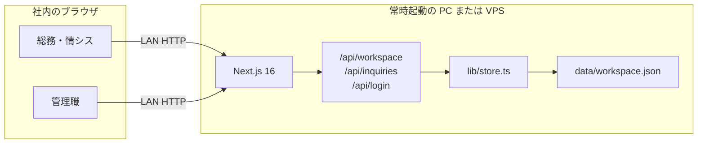
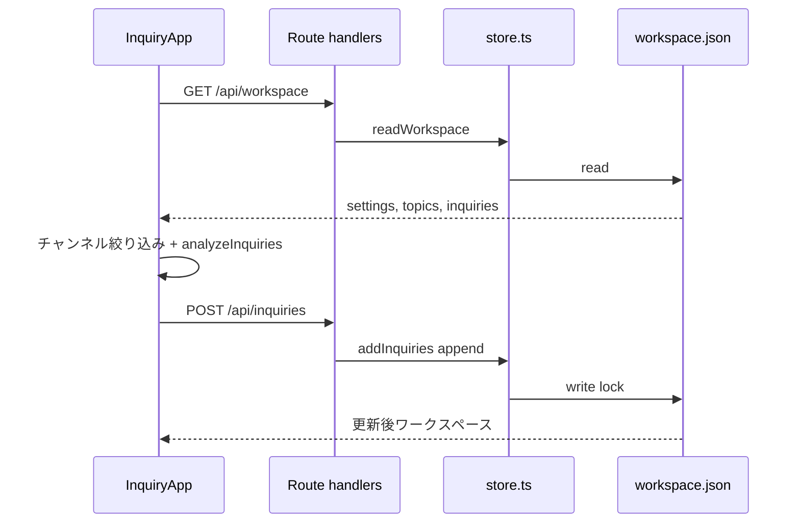

# システム構成

ECHO は Next.js の一体型アプリです。ブラウザは API 経由で同じ JSON ファイルを読み書きします。集計はサーバーに問い合わせたワークスペースを、クライアントの `analyzeInquiries` で計算します。

## 全体

## リクエスト

## プロセス内の役割

| 層 | 場所 | 役割 |
| --- | --- | --- |
| UI | `components/` | ダッシュボード、記録、設定、PIN、言語 |
| 文言 | `lib/messages.ts` | ja / en。本文は持たない |
| 集計 | `lib/analyze.ts` | 期間、キーワード分類、損失 |
| チャンネル | `lib/channels.ts` | 保存 ID と表示名 |
| 予測 | `lib/suggest.ts` | テーマからの入力候補 |
| 取り込み | `lib/parsePaste.ts` | 行・CSV・プレフィックス |
| API | `app/api/` | PIN 確認のあと store を呼ぶ |
| 永続化 | `lib/store.ts` | JSON の読み書き。追記は id 重複をスキップ |

## ランタイム制約

- `runtime = "nodejs"`（ファイル I/O のため）
- `dynamic = "force-dynamic"`（キャッシュしない）
- PIN あり: Cookie `echo_gate`（httpOnly）
- PIN なし: API は同一 LAN に開く

## 置かないもの

RDB、オブジェクトストレージ、認証プロバイダ、ジョブキューはありません。1オフィス・1プロセス向けです。
