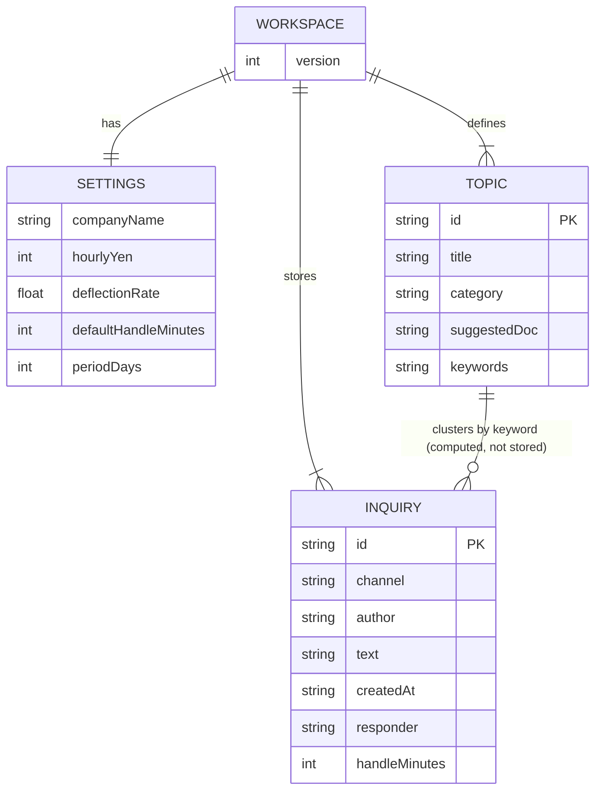

# データ設計

RDB は使いません。論理モデルは単一ドキュメント `data/workspace.json` です。

## 論理モデル



問い合わせとテーマの関係は保存しません。表示のたびに `clusterInquiry(text, topics)` が本文とキーワードを照合します。

## ファイル

パス: `data/workspace.json`（gitignore）

```json
{
  "version": 1,
  "settings": {
    "companyName": "自社",
    "hourlyYen": 3000,
    "deflectionRate": 0.7,
    "defaultHandleMinutes": 8,
    "periodDays": 30
  },
  "topics": [
    {
      "id": "expense",
      "title": "経費精算の方法",
      "category": "総務",
      "suggestedDoc": "経費精算クイックスタート（期限・領収書・承認者）",
      "keywords": ["経費", "精算", "領収書"]
    }
  ],
  "inquiries": [
    {
      "id": "uuid",
      "channel": "#社内",
      "author": "山田",
      "text": "経費精算の期限はいつですか？",
      "createdAt": "2026-09-13T10:00:00.000Z",
      "responder": "総務",
      "handleMinutes": 8
    }
  ]
}
```

## フィールド

### settings

| 項目 | 意味 |
| --- | --- |
| companyName | 設定用。ヘッダーには出さない |
| hourlyYen | 損失金額の時給 |
| deflectionRate | マニュアルで吸収する割合（0.1–1） |
| defaultHandleMinutes | 記録・貼り付けの既定分数 |
| periodDays | 集計期間。0 は全期間 |

### topics

よく聞かれるテーマ。`keywords` は本文に含まれるとその id に束ねる。複数ヒット時はヒット数、同点なら最長キーワード。

### inquiries.channel

保存値は正規化後の ID です。

| 保存 | ja 表示 | en 表示 |
| --- | --- | --- |
| `#社内` | `#社内` | `#internal` |
| `#社外` | `#社外` | `#external` |
| その他 | そのまま | そのまま |

空や `#internal` は読み書き時に `#社内` へ寄せます。

## 整合性

- 追記: 同じ `id` は入れない
- 置き換え: 問い合わせ配列を丸ごと入れ替え（取り消し不可）
- テーマ削除: 問い合わせは残る。次回集計で別テーマか未分類になる
- 書き込みはプロセス内キューで直列

## バックアップ

ファイルコピーで足りる。画面エクスポートは未実装。`GET /api/workspace` が同等の JSON を返す（PIN 設定時は Cookie 必須）。
