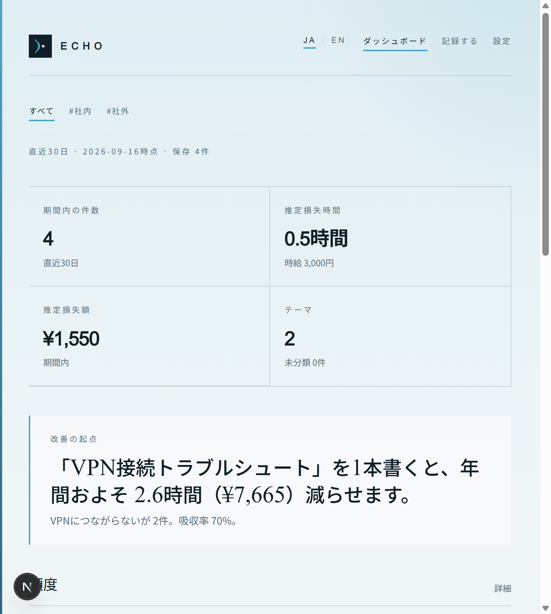
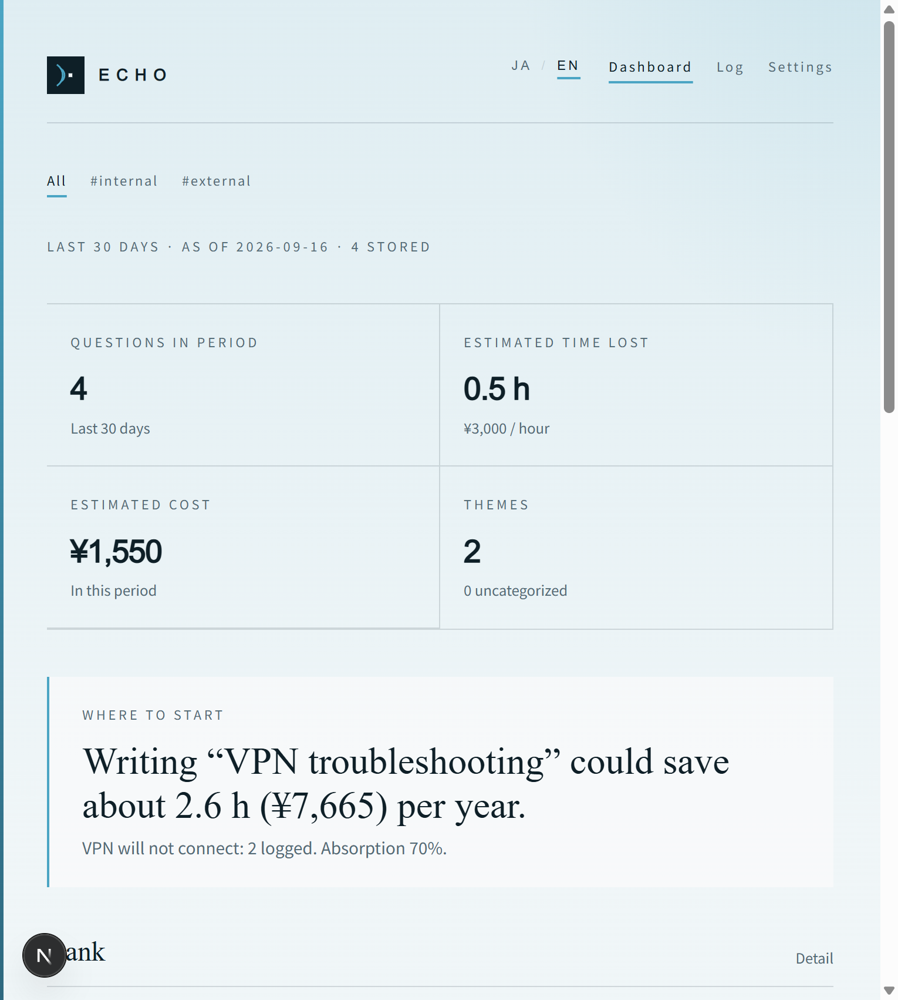
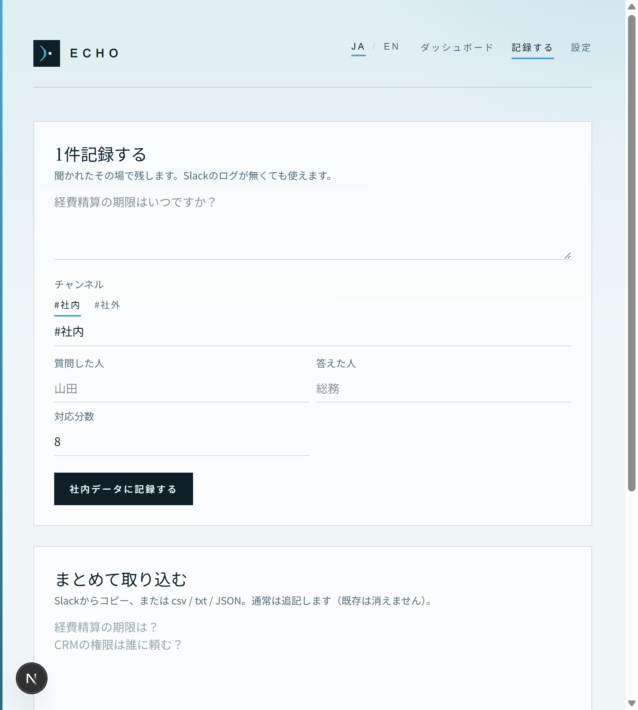
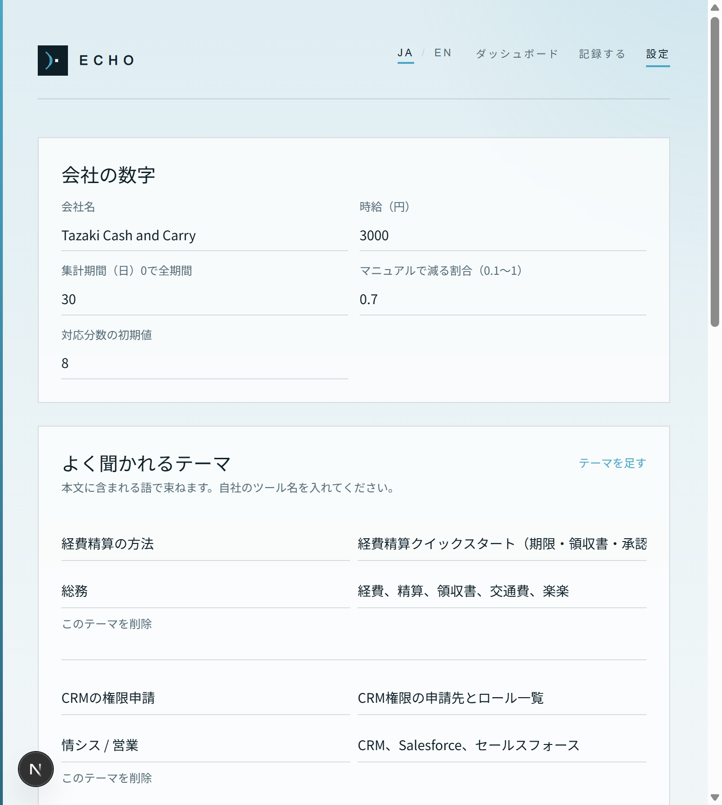

# スクリーンショット

実データの氏名は画面下部の詳細に出ることがあるので、ここには KPI とフォーム中心のキャプチャを置いています。

## ダッシュボード（日本語）

チャンネル（すべて / #社内 / #社外）、件数・時間・金額、先に書く文書。

## ダッシュボード（English）

チャンネルは `#internal` / `#external`。記録本文は翻訳しません。

## 記録する

1件入力と `#社内` / `#社外`。まとめて取り込みは下に続きます。

## 設定

時給・期間・吸収率と、よく聞かれるテーマのキーワード。
